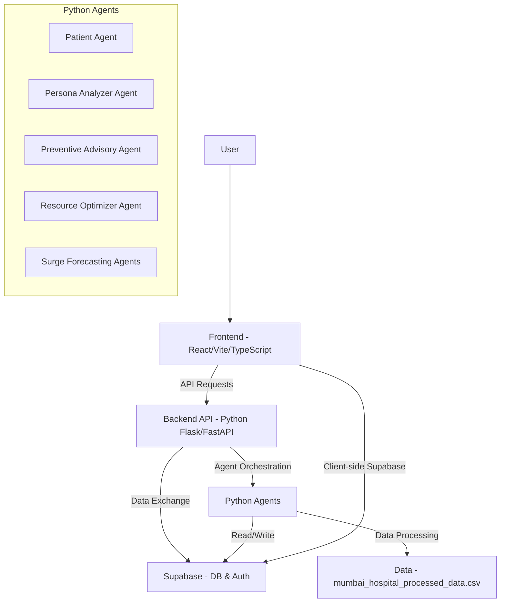

🏥 HealthGuard AI

Predictive Healthcare "Operating System" for Indian Hospitals > Built for MumbaiHacks 2025

📖 Overview

HealthGuard AI is an agentic AI system designed to solve the critical problem of unpredictable patient surges in Indian hospitals during festivals (Diwali, Ganesh Chaturthi), pollution spikes, and epidemics.

Unlike simple dashboards, HealthGuard AI acts as a collaborative team of autonomous agents that move from Prediction → Resource Optimization → Public Action without human intervention.

🤖 The Agentic Architecture

Our system is built around three core collaborating agents:

1. 🧠 Surge Forecasting Agent (The Brain)

Role: Predicts the when, where, and what of patient surges.

Tech: Uses LSTM (Long Short-Term Memory) networks on historical hospital admissions, AQI data, and Indian festival calendars.

Output: "Predicted +40% rise in respiratory cases in Ward F-North in 48 hours."

2. 🤖 Resource Optimizer Agent (The Commander)

Role: Autonomously manages hospital logistics in response to predictions.

Tech: Rule-based Logic Engine (simulating Deep Reinforcement Learning) to optimize bed and staff allocation.

Output: Actionable commands like "Allocating 15 additional ICU beds" or "Deploying 3 pulmonologists."

3. 📢 Preventive Advisory Agent (The Communicator)

Role: Proactive public health communication.

Tech: NLP & GenAI to create personalized, multilingual alerts (English, Hindi, Marathi).

Output: Targeted WhatsApp/SMS alerts: "Namaste Rahul, AQI is severe today. Please avoid outdoor travel."

🚀 Key Features

🇮🇳 Indian Context First: Specifically trained on data related to Indian festivals (Diwali, Holi) and local pollution patterns.

🗣️ Multilingual Support: Generates advisories in English, Hindi, and Marathi to reach the widest population.

⚡ Real-Time "Command Center": A unified dashboard showing live agent collaboration feeds.

📱 WhatsApp Integration: Simulates direct-to-patient alerts on a realistic mobile interface.

📊 Interactive Visualizations: Dynamic charts comparing capacity vs. predicted demand.

🛠️ Tech Stack

Frontend

Framework: React (Vite) + TypeScript

Styling: Tailwind CSS + Shadcn/UI

Icons: Lucide React

Runtime: Bun

Backend & AI (Architecture)

Core Logic: Python (Flask API)

Forecasting: LSTM / Prophet (Time-series analysis)

Orchestration: LangChain (Agent triggers)

Data Sources

Pollution: AQICN Historical Data (Mumbai)

Calendar: Indian Holiday Calendar 2023-2025

Health Data: Synthetic dataset modeled on HMIS aggregate trends.

📸 Screenshots

(Add your project screenshots here)

Main Dashboard

Preventive Agent

🏃‍♂️ Getting Started

Prerequisites

Node.js or Bun installed.

Python 3.9+ (for backend agents).

Installation

Clone the repository

git clone [https://github.com/Akash1072004/HealthGuard-AI.git](https://github.com/Akash1072004/HealthGuard-AI.git)
cd HealthGuard-AI

Install Frontend Dependencies

bun install
# or
npm install

Run the Development Server

bun run dev
# or
npm run dev

Open in Browser
Navigate to http://localhost:5173 to see the Agent Command Center.

📂 Project Structure

## System Architecture

The project is a full-stack application with a React/Vite frontend, a Python backend, and several Python agents for data processing and forecasting. It also integrates with Supabase for data storage and authentication.

### Frontend Architecture (React/Vite)
The frontend is built with React and Vite, utilizing TypeScript for type safety. It follows a component-based architecture, with a clear separation of concerns:

- **Entry Point**: `src/main.tsx` bootstraps the React application.
- **Main Application Component**: `src/App.tsx` likely defines the main layout and routing.
- **Styling**: Uses CSS modules (`src/App.css`, `src/index.css`) and potentially Tailwind CSS (`tailwind.config.ts`, `postcss.config.js`).
- **Components**:
    - `src/components/`: Contains reusable UI components (e.g., `Navbar.tsx`, `Layout.tsx`, `ThemeToggle.tsx`).
    - `src/components/sections/`: Contains larger, section-specific components (e.g., `ContactForm.tsx`, `DataVisualization.tsx`).
    - `src/components/ui/`: Contains UI primitives and styled components (e.g., `button.tsx`, `dialog.tsx`, `table.tsx`). This looks like a component library, possibly Shadcn UI.
- **Pages**: `src/pages/` directory holds page-level components that compose various components to form complete views (e.g., `DashboardHome.tsx`, `ForecastPage.tsx`, `AgentDetailPage.tsx`, `SignInPage.tsx`).
- **Hooks**: `src/hooks/` contains custom React hooks for reusable logic (e.g., `use-mobile.tsx`, `use-toast.ts`).
- **Utilities**: `src/lib/utils.ts` likely contains general utility functions.
- **Mocks**: `src/mocks/` includes mock data (e.g., `agentData.json`, `forecastData.json`) for development and testing.
- **Supabase Integration**: `src/integrations/supabase/` handles client-side interaction with Supabase for data and authentication.

### Backend API Architecture (Python)
The backend is a Python application, likely built using a framework like Flask or FastAPI, which handles API requests from the frontend and potentially orchestrates the execution of various agents.

- **Main Application**: `backend/app.py` serves as the primary entry point for the backend, defining routes and business logic.
- **Resource Agent API**: `backend/resource_agent.py` suggests a module specifically for handling resource-related API endpoints. This could involve managing hospital resources, allocating them, or providing information about their status.
- **Dependencies**: `backend/requirements.txt` specifies all necessary Python libraries for the backend, ensuring a reproducible environment.
- **Virtual Environment**: The `.venv/` directory is used to manage Python dependencies in an isolated environment, preventing conflicts with other Python projects.

### Agents/Data Processing Architecture (Python)
This project heavily relies on a set of Python-based agents, suggesting an intelligent system for various aspects of healthcare management, likely involving data analysis, machine learning, and automation.

- **Agent Directory**: The `Agent/` directory is the central hub for all agent-related logic.
- **Patient Agent**: `Agent/patient_agent.py` likely focuses on processing individual patient data, potentially for personalized insights or managing patient journeys.
- **Persona Analyzer Agent**: `Agent/persona_analyzer_agent.py` probably analyzes demographic and behavioral data to create patient or staff personas, which can inform resource allocation and advisory strategies.
- **Preventive Advisory Agent**: Comprising `Agent/PreventiveAdvisoryAgent.py` and `Agent/run_preventive_agent.py`, this agent is designed to provide proactive recommendations, perhaps for health interventions or resource deployment based on predicted scenarios.
- **Resource Optimizer Agent**: `Agent/resource_optimizer_agent.py` is a critical component for optimizing the allocation and utilization of hospital resources (e.g., beds, staff, equipment) based on real-time data and forecasts.
- **Surge Forecasting Agents**: The files `Agent/surge_forecasting_main.py` and `Agent/surge_forecasting_model.py` are dedicated to predicting surges, such as sudden increases in patient inflow due to an epidemic or other events. This likely involves machine learning models trained on historical data.
- **Data Source**: `Agent/mumbai_hospital_processed_data.csv` is a crucial data file, probably used by the surge forecasting or other agents as a training dataset or for live analysis.

### Data Storage and Authentication Architecture (Supabase)
Supabase serves as a robust backend-as-a-service (BaaS) providing both database capabilities and user authentication, simplifying development and scaling.

- **Supabase Configuration**: The `supabase/config.toml` file is used to configure the local Supabase instance or connect to a remote one, defining database schema, authentication rules, and other service settings.
- **Frontend Integration**: The files `src/integrations/supabase/client.ts` and `src/integrations/supabase/types.ts` are essential for client-side interactions. `client.ts` initializes the Supabase client and handles API calls for data manipulation, user authentication (sign-up, sign-in, session management), and real-time subscriptions. `types.ts` provides TypeScript type definitions for Supabase entities, ensuring type safety throughout the frontend application when interacting with the database.

### Overall System Flow

1.  **User Interaction**: Users interact with the React frontend.
2.  **Frontend-Backend Communication**: The React frontend communicates with the Python backend API for data and specific functionalities.
3.  **Agent Execution**: The Python backend or a separate scheduler might trigger the various Python agents for data processing, forecasting, advisory, and optimization.
4.  **Data Persistence**: Both frontend and backend (via Supabase client or server-side libraries) interact with the Supabase database for storing and retrieving data, and for user authentication.

This architecture suggests a powerful application aimed at health-related resource management and advisory, possibly leveraging AI/ML for predictive insights.

🔮 Future Roadmap

[ ] ABDM Integration: Connect with Ayushman Bharat Digital Mission for real patient health records.

[ ] IoT Integration: Real-time data form Smart Ventilators.

[ ] Voice Agents: IVR calls for elderly patients who cannot read SMS.

👥 Contributors

HealthGuard Innovators Team

Akash - Full Stack Developer

(Add other team members)

📄 License

This project is licensed under the MIT License - see the LICENSE file for details.
